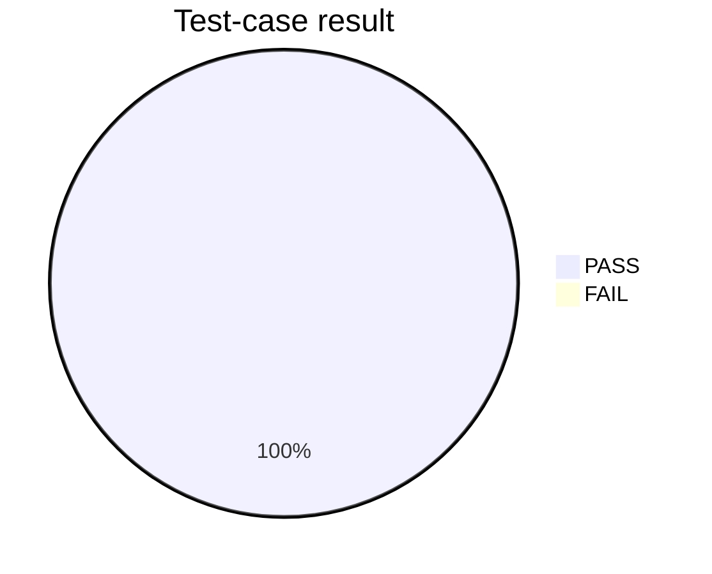
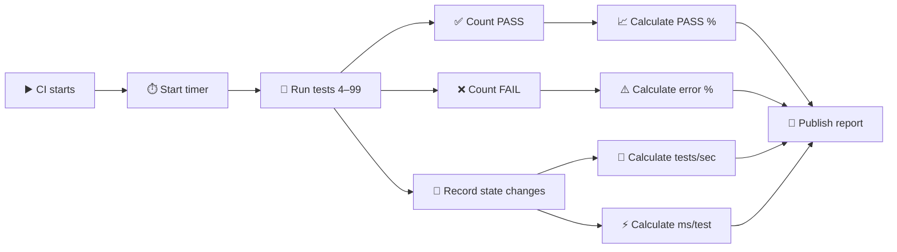

# 🚢🚀 Sentinel 99-Test: Post-Event Missile-Impact Analysis & Architecture Resilience Report

> **Public analytical report**  
> Scenario: **a hypothetical post-event investigation following a claimed missile impact on a U.S. naval vessel**.  
> This report explains what the software tests, what its evidence model can and cannot establish, and how every numbered test is interpreted.

---

## 🧭 1. Executive Overview

The Sentinel **99-Test Suite** is a stress and resilience test of an analytical architecture.

The scenario used for the public description is intentionally concrete:

> **A naval incident is reported, with a claim that a missile struck a U.S. naval vessel.**

The purpose of the suite is **not** to model how to attack a ship. It is to test what happens **after an alleged event** when an analyst has to work with incomplete, conflicting, delayed, noisy, or potentially manipulated information.

The central question is:

> **Can the architecture preserve evidence, identify inconsistencies, isolate bad data, maintain an audit trail, and produce a reproducible analytical state without silently turning uncertainty into certainty?**

That is the role this report documents.

---

## 🎯 2. What the Test Is Actually Testing

The suite examines five broad capabilities:

| Capability | What is being tested |
|---|---|
| 🛰️ Evidence handling | Whether public evidence can be represented and compared without silently replacing uncertainty with certainty |
| 🚢 Maritime context | Whether vessel-related evidence can be treated as one input among multiple evidence classes |
| 🧪 Data resilience | Whether invalid, incomplete, duplicated, or synthetic hostile data can be isolated |
| 🧠 Architecture resilience | Whether cores, layers, memory, resources, and checkpoints remain internally valid |
| 🔍 Auditability | Whether every major state transition leaves a record that can be inspected later |

The suite therefore behaves more like a **forensic laboratory** than a live battlefield system.

---

# 📊 3. Test Dashboard

### Numbering

The suite is called **99-Test** because the final numbered test is **Test 99**.

The current implementation contains numbered tests **4 through 99**, which equals:

**96 numbered test cases.**

This distinction is deliberately shown here so nobody mistakes “Test 99” for “99 independent tests.”

### Deterministic test baseline

| Metric | Meaning |
|---|---|
| 🧪 Numbered tests | **96** |
| 🔢 Final test number | **99** |
| ✅ PASS condition | No exception + post-test invariants remain valid |
| ❌ FAIL condition | A test raises an exception |
| 📈 PASS rate | Calculated automatically by CI |
| ⚠️ Error rate | Calculated automatically by CI |
| ⏱️ Runtime | Measured automatically by CI |
| 🚀 Throughput | Calculated as tests/second |
| ⚡ Average | Calculated as milliseconds/test |

The current code now records:

- `elapsed_s`
- `tests_per_second`
- `avg_test_ms`
- `pass_rate_pct`
- `fail_rate_pct`

These values are generated from the **actual CI execution**, rather than being manually typed into the report.

### 📈 Result visualization

The generated CI report contains a result chart equivalent to:



> **Important:** The chart above is the deterministic clean-run baseline represented by the suite logic. The authoritative run-specific PASS/FAIL and timing numbers are the values generated by GitHub Actions in the CI artifact.

### ⚡ Performance measurement pipeline



### What “speed” means here

**Speed is execution speed, not analytical accuracy.**

A fast run does not mean a real-world conclusion is correct. It only means the test suite completed its synthetic workload quickly on the CI runner.

---

# 🧩 4. How One Test Works

Each numbered test follows the same general pattern:

```text
Initial architecture state
          ↓
Synthetic fixture / scenario input
          ↓
Controlled state change
          ↓
Observed output
          ↓
Invariant validation
          ↓
Checkpoint / digest
          ↓
PASS or FAIL
```

The important feature is that the suite preserves a **before-state and after-state**.

That means a reader can inspect:

- what existed before the test,
- what input was introduced,
- what operation occurred,
- what changed,
- what remained unchanged,
- and whether the resulting state still satisfied the architecture invariants.

---

# 🧪 5. The Main Test Families

## 🧠 Tests 4–10: Analytical Foundations

These tests examine predictive-state handling, risk, security resilience, governance complexity, adaptability, and core integrity.

The goal is to establish that the architecture has a stable baseline before severe stress is introduced.

---

## 🌊 Tests 11–20: Crisis and Information Stress

This block introduces:

- geopolitical-crisis labels,
- misinformation,
- incomplete information,
- rapid scaling,
- conflicts between layers,
- partial failures,
- rule changes,
- and environmental change.

These tests are important for the naval scenario because a post-event investigation rarely arrives as a neat single data point.

Instead, analysts may see:

**claim → counterclaim → missing AIS → satellite observation → delayed report → duplicated record → corrected record.**

The architecture needs to keep those states distinct.

---

## 🌑 Tests 21–30: Dark Stress Scenarios

The “dark” tests are deliberately severe synthetic conditions.

They include memory collapse, governance conflict, misinformation floods, resource shortages, failure chains, security breaches, uncontrolled evolution, and total governance-collapse fixtures.

These do **not** simulate a real military attack.

They test whether extreme information or system stress can corrupt the analytical architecture itself.

---

## 🧱 Tests 31–40: Survival, Memory and Recovery

These tests examine:

- break-point behavior,
- architecture survival,
- inter-layer dependency,
- coordination stability,
- memory consistency,
- knowledge integrity,
- learning stability,
- decision adaptation,
- reversibility,
- and long-term evolution.

For a post-event analysis system, the key property is not merely “did it output something?”

The key property is:

> **Can the same evidence and the same state be reconstructed later?**

---

## 🛡️ Tests 41–45: Security and Anti-Collapse

These tests introduce security-related fixtures and degraded conditions.

The system records the event rather than allowing malformed state to silently propagate.

---

## 🔬 Tests 46–60: Decision Quality and Auditability

This section is heavily oriented toward analytical quality:

- decision scoring,
- analytical-error review,
- data-bias review,
- transparency,
- compliance,
- convergence,
- human review,
- and long-duration resilience.

These are particularly relevant when different sources disagree.

---

## ⚖️ Tests 61–70: Ethics, Coordination and Resources

These tests examine decision-related state, distributed coordination, cumulative error, resource balance, and fairness-labelled fixtures.

They are intended to detect situations where a system can remain technically functional while its analytical state becomes difficult to audit.

---

## 🌐 Tests 71–85: System Maturity

This block examines ecosystem compatibility, layer persistence, adaptation, system integrity, overall robustness, long-term readiness, cultural/environmental adaptation, and architectural maturity.

---

## 🔧 Tests 86–90: Finding and Fixing Problems

These tests focus on:

**detect → correct → re-test → prevent regression.**

The important concept is that an architecture should not merely announce that a defect exists.

It should preserve evidence that the correction was applied and that the repaired state remains stable.

---

## 🏁 Tests 91–99: Final Validation

The final block includes:

- final inter-core coordination,
- final inter-layer coordination,
- maximum synthetic load,
- unknown-scenario stability,
- cross-domain generalization,
- quality preservation during evolution,
- final-version readiness,
- comprehensive audit,
- and final comprehensive validation.

Test 99 is therefore the **final numbered validation gate**.

---

# 🚢🚀 6. Naval Incident Evidence Model

For the public naval-impact scenario, the evidence model is divided into independent evidence classes.

### Class A: Vessel identity

Examples:

- official U.S. Navy fact files,
- Naval Vessel Register,
- public vessel documentation.

### Class B: Maritime movement

Examples:

- AIS-derived information,
- vessel-track datasets,
- public maritime databases.

### Class C: Remote sensing

Examples:

- Sentinel-1 / Sentinel-2,
- other Copernicus data,
- NASA Earth-data products.

### Class D: Independent reporting

News, public statements, photographs, and other publicly accessible material can be treated as contextual evidence.

### Class E: Contradiction evidence

Instead of deleting conflicting information, the architecture records the conflict as a condition requiring further analysis.

This is one of the most important principles in the report.

---

# 🛰️ 7. Public Evidence Sources

## 🇺🇸 U.S. Navy Fact Files

Official public information about U.S. Navy platforms and systems.

🔗 https://www.navy.mil/resources/fact-files/

## ⚓ Naval Vessel Register

Official NAVSEA reference for naval-vessel information and lifecycle status.

🔗 https://www.navsea.navy.mil/Resources/Naval-Vessel-Register/

## 📡 NOAA Nationwide AIS

NOAA public AIS-related metadata and information.

🔗 https://www.fisheries.noaa.gov/inport/item/80362

## 🧭 NOAA AIS Vessel Tracks

Public vessel-track dataset information and associated limitations.

🔗 https://www.fisheries.noaa.gov/inport/item/79504

## 🛰️ ESA / Copernicus Sentinel-1

Public explanation of Sentinel-1 maritime monitoring and the relationship between SAR and AIS.

🔗 https://www.esa.int/Applications/Observing_the_Earth/Copernicus/Sentinel-1/Tracking_maritime_traffic

## 🌍 Copernicus Data-Space Discussion

Public discussion of access limitations around some Sentinel-1/AIS-related data.

🔗 https://forum.dataspace.copernicus.eu/t/availability-of-sentinel-1-ais-data/4798

## 🔥 NASA FIRMS

NASA Earth-data source for thermal/fire observations.

🔗 https://earthdata.nasa.gov/firms

---

# ⚠️ 8. What These Sources Can and Cannot Prove

No single public source listed above can independently prove:

- that a missile was launched,
- that a particular missile caused damage,
- the exact impact mechanism,
- the identity of an attacker,
- or a meter-level impact coordinate.

AIS can contain gaps.

Satellite observations depend on sensor type, timing, viewing conditions and resolution.

A thermal anomaly can support an investigation, but a thermal anomaly by itself is **not equivalent to proof of missile impact**.

The architecture therefore treats evidence as a chain:

```
Observation
   ↓
Source identification
   ↓
Timestamp / context
   ↓
Cross-source comparison
   ↓
Conflict detection
   ↓
Evidence classification
   ↓
Limited conclusion
```

---

# 🧯 9. Synthetic Failure Injection

The suite intentionally introduces artificial bad conditions.

Examples include:

### 🗑️ Invalid records

Records with impossible confidence values or untrusted metadata are inserted.

The expected response is **quarantine**, not silent acceptance.

### 🧬 Duplicate memory

Duplicate records are introduced and then passed through a deterministic deduplication step.

### 🛡️ Hostile fixtures

Synthetic malformed/security-style payloads are introduced to verify that the architecture records and handles them.

### 📈 Resource pressure

Synthetic loads increase CPU/memory/queue values inside the model.

### 🧱 Layer degradation

A layer is marked degraded and a checkpoint is retained.

### 🔄 Version changes

Architecture version state is changed in a controlled way.

### 🧾 Governance conflict

Conflict counters and audit events are increased to verify traceability.

---

# 📋 10. Complete Test Matrix

| # | Test | What it checks |
|---:|---|---|
| 4 | Predictive intelligence | Checks whether predictive-state logic remains internally consistent under the scenario fixture. |
| 5 | High-level self-awareness | Checks architecture self-state bookkeeping and audit visibility. |
| 6 | Risk assessment | Checks whether a scenario can be processed through explicit risk-state changes. |
| 7 | Security resilience | Checks whether the architecture remains valid while security-related stress is introduced. |
| 8 | Governance complexity | Checks handling of governance-state pressure and audit accumulation. |
| 9 | Adaptability | Checks controlled version/state adaptation. |
| 10 | Core integrity | Checks that the expected set of cores/layers remains structurally valid. |
| 11 | Geopolitical crisis | Checks architecture behavior under a crisis-labelled scenario. |
| 12 | Information-flood / misinformation | Checks quarantine behavior for invalid or untrusted records. |
| 13 | Data collapse | Checks resilience when a large invalid-data batch is introduced. |
| 14 | Incomplete information | Checks behavior when evidence is intentionally insufficient. |
| 15 | Rapid growth and scaling | Checks resource state under increased load. |
| 16 | Cross-core conflict resolution | Checks whether conflicts can be represented and audited. |
| 17 | Partial system failure | Checks degraded-layer handling and checkpoint preservation. |
| 18 | Rule-change adaptation | Checks controlled adaptation after an architecture rule/version change. |
| 19 | Extreme complexity scenario | Checks resource and state invariants under high complexity. |
| 20 | Environmental change | Checks adaptation to changing external conditions. |
| 21 | Dark memory-collapse stress | Checks memory handling under severe synthetic stress. |
| 22 | Dark governance-conflict storm | Checks governance state under repeated conflict pressure. |
| 23 | Dark misinformation flood | Checks quarantine against a larger invalid-data flood. |
| 24 | Dark unbounded complexity | Checks maximum synthetic resource-load handling. |
| 25 | Dark resource shortage | Checks resource safeguards under constrained conditions. |
| 26 | Dark predictive-failure chain | Checks degraded-state handling through a failure-chain fixture. |
| 27 | Dark security breach | Checks security-related invalid-input handling. |
| 28 | Dark self-awareness failure | Checks audit/state integrity when self-state is stressed. |
| 29 | Dark uncontrolled evolution | Checks controlled version evolution under stress. |
| 30 | Dark total governance collapse | Checks whether governance failure is represented without corrupting core invariants. |
| 31 | Final break-point test | Probes a deliberately degraded layer near the architecture's synthetic break point. |
| 32 | Architecture survival | Checks whether core/layer invariants survive accumulated stress. |
| 33 | Inter-layer dependency | Checks state interactions between architectural layers. |
| 34 | Coordination stability | Checks persistence of coordination-related state. |
| 35 | Memory consistency | Checks duplicate-memory detection and cleanup. |
| 36 | Knowledge integrity | Checks whether knowledge-state fixtures remain structurally valid. |
| 37 | Learning stability | Checks repeatable state updates related to learning fixtures. |
| 38 | Decision adaptability | Checks decision-state adaptation across controlled changes. |
| 39 | Reversibility | Checks whether checkpoints exist for state recovery. |
| 40 | Long-term evolution stability | Checks repeated version/state evolution. |
| 41 | Cyber defense | Checks security fixture handling. |
| 42 | Attack resistance | Checks architecture response to hostile-input fixtures. |
| 43 | Evolutionary safety | Checks constrained architectural evolution. |
| 44 | Complexity management | Checks resource accounting under complexity pressure. |
| 45 | Anti-collapse architecture | Checks whether degradation stays bounded by recorded state invariants. |
| 46 | Decision quality index | Checks deterministic decision-score aggregation. |
| 47 | Analytical error review | Checks auditability of analytical state. |
| 48 | Data-bias review | Checks deterministic data-review pathways. |
| 49 | Transparency audit | Checks explicit audit-event recording. |
| 50 | Compliance monitoring | Checks governance/compliance state updates. |
| 51 | Long-term convergence review | Checks repeated stable state evolution. |
| 52 | Inter-core coordination stability | Checks coordination state across cores. |
| 53 | Evolutionary safety under change | Checks safe version-state transitions. |
| 54 | Central complexity monitoring | Checks resource changes under complexity. |
| 55 | Anti-collapse architecture validation | Checks invariants after stress. |
| 56 | Decision-quality monitoring | Checks decision metrics and state bookkeeping. |
| 57 | Human-feedback inspection | Checks audit/state readiness for human review. |
| 58 | Convergence stability review | Checks repeated checkpoint generation. |
| 59 | Long-duration resilience | Checks resilience across accumulated synthetic changes. |
| 60 | Environmental-adaptation review | Checks adaptation-related version updates. |
| 61 | Ethical alignment | Checks deterministic decision/alignment fixtures. |
| 62 | Automated robustness review | Checks system-state robustness under repeated operations. |
| 63 | Decision resistance | Checks deterministic decision-state behavior. |
| 64 | Distributed-processing coordination | Checks coordination bookkeeping across distributed-style fixtures. |
| 65 | Cumulative-error assessment | Checks whether accumulated changes remain auditable. |
| 66 | Information-convergence review | Checks stable information-state handling. |
| 67 | Upgrade-path audit | Checks version progression and checkpointing. |
| 68 | Resource balance | Checks resource-state bounds. |
| 69 | Decision fairness | Checks deterministic decision-score distribution. |
| 70 | Final control review | Checks final audit/state-control conditions. |
| 71 | Ecosystem compatibility | Checks architecture adaptation across wider environment labels. |
| 72 | Layer persistence | Checks persistence of layer structure during change. |
| 73 | Decision compatibility audit | Checks decision-related state compatibility. |
| 74 | Inter-core information coordination | Checks coordination-state consistency. |
| 75 | Final convergence validation | Checks convergence-related final state. |
| 76 | Adaptive stability | Checks repeated controlled adaptation. |
| 77 | System integrity | Checks global structural invariants. |
| 78 | Ethical compliance review | Checks ethical/compliance-labelled decision fixtures. |
| 79 | Overall robustness audit | Checks broad invariants after accumulated stress. |
| 80 | Long-term readiness | Checks continued state bookkeeping and readiness. |
| 81 | Cultural adaptation | Checks adaptation-labelled version changes. |
| 82 | Human-resource balance | Checks resource bounds under a human-resource label. |
| 83 | Strategic alignment | Checks deterministic alignment state. |
| 84 | Environmental compatibility review | Checks adaptation under environment changes. |
| 85 | Architecture maturity audit | Checks overall structural readiness. |
| 86 | Issue extraction and prioritization | Checks audit/state visibility for detected conditions. |
| 87 | Correction validation | Checks state validity after corrective changes. |
| 88 | Post-correction stability | Checks persistence after corrections. |
| 89 | Regression prevention | Checks that previous invalid-state conditions do not silently reappear. |
| 90 | Overall architecture-quality validation | Checks broad final invariants. |
| 91 | Final inter-core coordination | Checks coordination at final-suite stage. |
| 92 | Final inter-layer coordination | Checks layer coordination at final-suite stage. |
| 93 | Maximum-load resilience | Checks high synthetic resource load. |
| 94 | Unknown-scenario stability | Checks generic structural probe under an unknown label. |
| 95 | Cross-domain generalization | Checks generic architecture behavior across domain-labelled cases. |
| 96 | Quality preservation during evolution | Checks quality/state invariants across evolution. |
| 97 | Final-version readiness | Checks final version/state progression. |
| 98 | Comprehensive architecture audit | Checks broad audit and invariant coverage. |
| 99 | Final comprehensive validation | Final numbered architecture validation gate. |

---

# 🔐 11. Audit and Reproducibility

Each test records a state digest.

Conceptually:

```
state → JSON representation → SHA-256 digest → checkpoint
```

This creates a reproducibility trail.

If the same deterministic fixture produces a different state unexpectedly, the digest can expose that change.

This does **not** make the architecture mathematically infallible.

It simply makes state changes easier to detect and audit.

---

# 📈 12. Error, PASS and Performance Interpretation

### PASS rate

```
PASS rate = PASS test cases / numbered test cases × 100
```

### Error rate

```
Error rate = FAIL test cases / numbered test cases × 100
```

### Throughput

```
Tests per second = numbered tests / elapsed runtime
```

### Average test time

```
Average ms/test = elapsed runtime / numbered tests × 1000
```

These four values are produced automatically by the updated test runner.

---

# 🧠 13. What a PASS Actually Means

A PASS means:

> The tested synthetic fixture completed without an exception and the architecture's programmed invariants remained valid.

A PASS does **not** mean:

> “The real-world event happened exactly as modeled.”

It does not establish that a particular ship was hit, where an impact occurred, who caused it, or what weapon was involved.

That distinction is intentionally central to this public report.

---

# 🚫 14. Explicit Scope Boundary

This suite does **not** perform:

- weapon guidance,
- target selection,
- attack-path optimization,
- firing solutions,
- live military targeting,
- real-time combat control,
- or operational attack planning.

It is a **post-event analytical resilience and evidence-management test**.

---

# 🧪 15. What Is Real and What Is Synthetic?

| Element | Status |
|---|---|
| Test architecture | Real code |
| State transitions | Real code execution |
| Checksums | Real generated values |
| CI runtime | Real CI measurement |
| Public source URLs | Real public references |
| Misinformation fixtures | Synthetic |
| Invalid records | Synthetic |
| Resource load | Synthetic |
| Security payload fixtures | Synthetic |
| Claimed naval incident | Scenario framing, not independently established here |
| Missile-impact conclusion | Not established by this suite |

---

# 🔗 16. Public GitHub Files

### 📄 Full public report
https://github.com/salehshahab999-gif/sentinel-command/blob/test/architecture-99-suite/NAVAL-MISSILE-IMPACT-99-TEST-REPORT.md

### 💻 Test source code
https://github.com/salehshahab999-gif/sentinel-command/blob/test/architecture-99-suite/tools/architecture_99_suite.py

### ⚙️ GitHub Actions workflow
https://github.com/salehshahab999-gif/sentinel-command/blob/test/architecture-99-suite/.github/workflows/architecture-99-ci.yml

### 📁 Test branch
https://github.com/salehshahab999-gif/sentinel-command/tree/test/architecture-99-suite

---

# 🏁 17. Final Assessment

The purpose of the Sentinel 99-Test suite is to determine whether an analytical architecture can remain **traceable, resilient, reproducible and auditable** while processing a difficult post-event scenario involving a claimed missile impact on a naval vessel.

The strongest part of the design is not a single PASS value.

It is the chain:

**evidence → state → transformation → checkpoint → validation → audit.**

That chain allows a later reviewer to ask:

> **What did the system know? What did it receive? What changed? What was rejected? What remained uncertain?**

That is the standard this public report is intended to document.

---

### 📝 Report note

**Scenario:** Post-event public-evidence analysis  
**Suite:** Sentinel Architecture 99-Test  
**Numbered tests:** 96 (tests 4–99)  
**Final numbered gate:** Test 99  
**Runtime metrics:** generated automatically by CI  
**Public evidence:** linked above  
**Operational targeting:** outside scope
